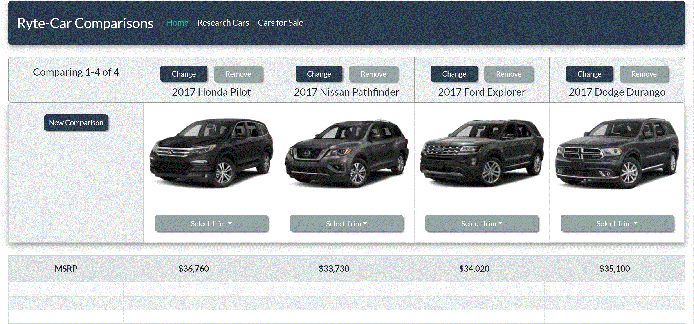

# Ryte-Car Comparisons

## *A very helpful car comparison web app that allows users to very easily compare cars side-by-side.  App contains a unique hover popover feature currently not present on any other car-comparison website.  Simply hover over the info icon and detailed information differentiating that trim level from the others will appear in a popover.*

To run locally:
* `npm install`
* `npm run start` (starts the express server)
* `cd client`
* `npm install` (yep, again in the client/ folder!)
* `npm run start` (starts the webpack dev server)

That will start the dev server and open a tab to <http://localhost:3000/>. The express-based piece of the homework will be running on <http://localhost:4000/>.

To deploy to heroku:
* **copy this folder to a location outside the current repo**
* `git init`
* `echo node_modules > .gitignore`
* `git add .`
* `git commit -m "Initial commit"`
* `heroku create` (likely to take a while, if it times out, run again)
* `git push heroku master`
